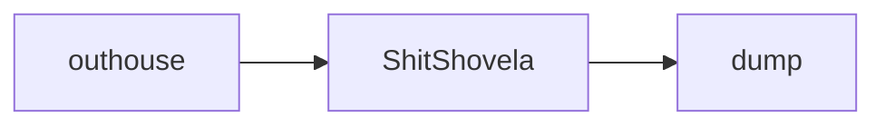
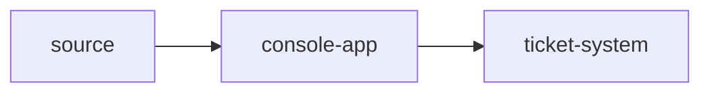
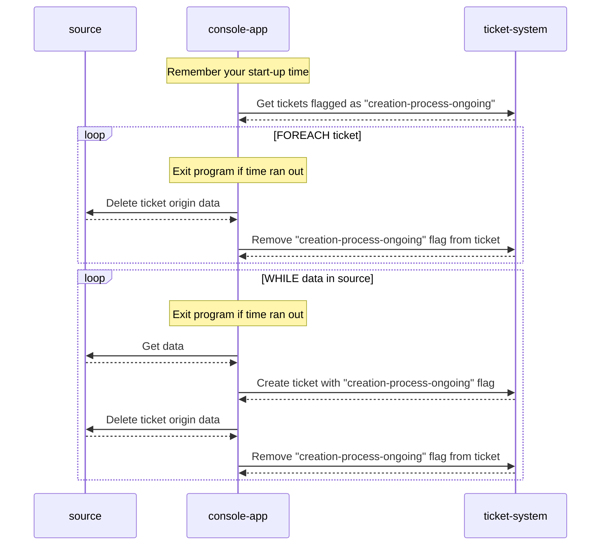

# ShitShovela

> Every proper Orc starts their career next to an outhouse with a shovel.
> So let's get moving.

This is a batch job to collect data from a source to create tickets in a
ticket system, to finally remove the original data from the source.

## Constraints
- All system interactions happen over network.
- Least amount of complexity as possible. E.g. no supporting 
    systems/components (no persistent storage, no additional messaging
    service, ...)
- No GUI. But console logs are required.
- Don't DOS our systems. Don't flood our ticket system with duplicates. It's
    better to fail/crash than to harm the ticket system.
- Never exceed an externally provided maximum runtime duration.
- Configurations will be provided via environment variables.

## Data Flow
> Move shit from `outhouse` to `dump`.

Move data from `source` into `ticket-system`.

To minimize data loss in case of failed network connections or wrongly set
permissions the following interactions actions happen in order. Also
this action flow should prevent pointlessly created tickets.

`console-app` does not have a persistent data storage (db/s3/mount) to reduce 
its complexity by reducing the number of components.
